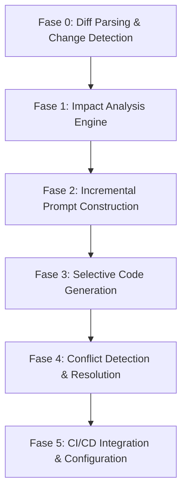

# Geração Incremental de Código com Otimização Baseada em Diff

Este documento descreve a análise técnica do estado atual (As Is), os objetivos e a proposta técnica detalhada de implementação passo a passo e o planejamento de testes TDD para a adição da capacidade de **geração incremental de código** no pipeline de Design-to-Code.

A implementação segue os requisitos descritos na especificação de design [spec-incremental-code-generation.md](file:///Users/sysout/codesys/projects/design-to-code/docs/adr/spec-incremental-code-generation.md).

---

## 1. Análise do Estado Atual (As Is)

Atualmente, o pipeline opera no modelo de **geração completa (Full Code Generation)**. A análise detalhada da base de código revela as seguintes características e limitações:

### 1.1 Leitura Completa de Especificações
* **Mecanismo Atual**: O [PipelineOrchestrator.kt](file:///Users/sysout/codesys/projects/design-to-code/src/main/kotlin/com/designtocode/cli/PipelineOrchestrator.kt) recebe uma lista de caminhos de arquivos modificados (`changedFiles`), mas repassa esses caminhos diretamente ao [PromptConstructor.kt](file:///Users/sysout/codesys/projects/design-to-code/src/main/kotlin/com/designtocode/domain/PromptConstructor.kt).
* **Limitação**: O [PromptConstructor.kt](file:///Users/sysout/codesys/projects/design-to-code/src/main/kotlin/com/designtocode/domain/PromptConstructor.kt) lê o conteúdo **completo** de cada especificação modificada e o injeta no prompt final do LLM. O sistema não diferencia quais seções específicas do design foram alteradas (por exemplo, a adição de um novo endpoint ou um campo de DTO).
* **Código Morto/Inativo**: O método `parseChangedFiles(gitDiffOutput: String)` em [ContextBuilder.kt](file:///Users/sysout/codesys/projects/design-to-code/src/main/kotlin/com/designtocode/domain/ContextBuilder.kt) é apenas um helper que formata linhas do git diff, mas **não está integrado** na lógica principal de execução do pipeline.

### 1.2 Ausência de Análise de Impacto (Impact Analysis)
* **Limitação**: O pipeline não tem conhecimento das relações entre os arquivos de design (especificações) e a estrutura do código-fonte Kotlin existente no workspace.
* **Consequência**: Não há mapeamento inteligente que associe, por exemplo, a alteração de um endpoint `/users` nas especificações ao controller `UserController.kt` ou à classe de modelo `User.kt`. O LLM recebe o prompt inteiro e precisa deduzir as relações por si mesmo, o que eleva a probabilidade de falhas e reescritas de arquivos não relacionados.

### 1.3 Inexistência de Preservação de Contexto Local (Context Preservation)
* **Limitação**: A construção de prompts em [PromptConstructor.kt](file:///Users/sysout/codesys/projects/design-to-code/src/main/kotlin/com/designtocode/domain/PromptConstructor.kt) não injeta o código-fonte existente do workspace no prompt enviado ao LLM.
* **Consequência**: O LLM gera código "no escuro", sem ter visibilidade da implementação real que já está no repositório. Isso impede que ele respeite alterações e customizações feitas manualmente por engenheiros humanos nas classes de negócio, controllers ou repositórios, sobrescrevendo-as cegamente.

### 1.4 Escrita Reativa no Adaptador
* **Limitação**: O [OllamaAdapter.kt](file:///Users/sysout/codesys/projects/design-to-code/src/main/kotlin/com/designtocode/domain/adapter/OllamaAdapter.kt) possui suporte primitivo a marcadores `MODIFY`, `DELETE` e blocos de código com caminhos nas respostas do LLM. No entanto, ele executa as alterações de forma cega no workspace, sobrescrevendo arquivos inteiros ou aplicando substituições básicas de linhas baseadas em coordenadas numéricas enviadas pelo LLM (que frequentemente falham devido a desalinhamentos de numeração causados por edições prévias).
* **Interface Engessada**: Não existe uma porta/interface no domínio ([AIAgentPort.kt](file:///Users/sysout/codesys/projects/design-to-code/src/main/kotlin/com/designtocode/domain/port/AIAgentPort.kt)) que represente especificamente a geração cirúrgica ou incremental baseada em relatório de impacto; a assinatura atual é simplesmente `generate(prompt: String, workspace: File)`.

### 1.5 Falta de Detecção e Resolução de Conflitos
* **Limitação**: Sobrescrever arquivos existentes no workspace diretamente por meio do adaptador de IA gera perda de código personalizado. O pipeline não detecta se o trecho alterado possui implementações manuais customizadas.
* **Limitação**: Não existem estratégias parametrizáveis para lidar com conflitos (ex: dar prioridade à IA, prioridade ao código manual existente, ou tentar realizar um merge inteligente de código-fonte).

### 1.6 Configuração Limitada
* **Limitação**: A classe [PipelineConfig.kt](file:///Users/sysout/codesys/projects/design-to-code/src/main/kotlin/com/designtocode/config/PipelineConfig.kt) e o leitor [ConfigLoader.kt](file:///Users/sysout/codesys/projects/design-to-code/src/main/kotlin/com/designtocode/config/ConfigLoader.kt) não possuem propriedades parametrizando comportamentos incrementais, o que impede a ativação parcial ou a customização de estratégias de resolução de conflitos por parte dos desenvolvedores.

---

## 2. Objetivo da Implementação (To Be)

O objetivo principal é dotar o pipeline Design-to-Code da capacidade de **gerar código cirurgicamente (Geração Incremental)**. O comportamento pretendido do sistema após a conclusão das fases é:

1. **Detecção de Mudanças Focada**: Identificar precisamente o que mudou na especificação por meio do parsing da saída de um `git diff` de especificações de design, gerando relatórios de modificações estruturadas (`SpecChange`).
2. **Engenharia de Impacto**: Mapear as modificações estruturadas da especificação diretamente aos arquivos Kotlin no workspace correspondentes e seus dependentes imediatos através de um traversal de grafo de dependência, gerando um `ImpactReport`.
3. **Construção de Prompt Enriquecido com Contexto**: Formular um prompt restrito que inclua apenas os diffs da especificação relevantes e o código original das classes afetadas no workspace, enriquecido com **âncoras ou comentários de preservação** de trechos manuais para orientar a IA sobre o que ela não pode reescrever.
4. **Geração Seletiva e Segura**: Realizar a chamada de geração seletiva com o adaptador de IA, mantendo o controle cirúrgico da escrita de arquivos e limitando as alterações às fronteiras do sandbox estipulado no relatório de impacto.
5. **Detecção e Resolução Ativa de Conflitos**: Avaliar se as alterações geradas pela IA colidem com modificações manuais do código atual e aplicar a estratégia de resolução parametrizada pelo usuário (ex: preservar código manual, aplicar o da IA ou tentar merging).
6. **Integração Completa em Pipeline e CLI**: Oferecer total suporte a flags de configuração via `pipeline.yml` e inputs do GitHub Actions ([design-to-code-pipeline.yml](file:///Users/sysout/codesys/projects/design-to-code/.github/workflows/design-to-code-pipeline.yml)), validando o comportamento fim a fim com testes de integração e garantindo 100% de cobertura.

---

## 3. Passo a Passo da Implementação (Fases 0 a 5)

A implementação será dividida em 6 fases lógicas sequenciais. Cada fase possui ramificação específica de desenvolvimento (`branch`) e conjunto granular de tarefas e commits baseados no modelo de desenvolvimento TDD.



---

### Fase 0: Diff Parsing & Change Detection
**Objetivo:** Implementar a lógica de parsing de git diff para identificar alterações estruturadas em arquivos de especificação (OpenAPI / Markdown) e atualizar o orchestrador de pipeline.
**Branch:** `feature/diff-parsing-change-detection`

1. **Criar Modelo de Domínio [SpecChange.kt](file:///Users/sysout/codesys/projects/design-to-code/src/main/kotlin/com/designtocode/domain/model/SpecChange.kt)**:
   - Tipo: `data class`.
   - Propriedades:
     - `filePath: String` (Caminho absoluto ou relativo do arquivo de spec de design).
     - `changeType: ChangeType` (Enum: `ADD`, `MODIFY`, `DELETE`).
     - `oldContent: String?` (Conteúdo do trecho antes da alteração).
     - `newContent: String?` (Novo conteúdo do trecho alterado).
     - `lineNumberRange: IntRange?` (Range de linhas no arquivo de especificação original).
     - `affectedSection: String` (Seção lógica afetada, ex: `paths./users.post` ou `components.schemas.UserDto`).
   - Métodos:
     - `calculateChangeImpact(): Double` (Calcula a complexidade/impacto estimado da alteração).
   - Enum `ChangeType` com os valores `ADD`, `MODIFY`, `DELETE`.

2. **Criar Serviço de Domínio [SpecDiffParser.kt](file:///Users/sysout/codesys/projects/design-to-code/src/main/kotlin/com/designtocode/domain/SpecDiffParser.kt)**:
   - Classe responsável pelo processamento do diff.
   - Fornece o método:
     ```kotlin
     fun parseDiff(gitDiffOutput: String): List<SpecChange>
     ```
   - Lógica: Itera sobre as linhas do diff do git e agrupa blocos adicionados (`+`), removidos (`-`) e cabeçalhos de hunk (`@@`). Reconhece os arquivos sob diretórios de design e extrai as seções estruturadas (YAML/Markdown).

3. **Modificar [PipelineOrchestrator.kt](file:///Users/sysout/codesys/projects/design-to-code/src/main/kotlin/com/designtocode/cli/PipelineOrchestrator.kt)**:
   - Adiciona dependência à instância de `SpecDiffParser`.
   - Modifica o fluxo de orquestração: o pipeline extrai o diff de git das especificações de design no workspace, chama o `SpecDiffParser.parseDiff()`, e armazena os `SpecChange` para uso subsequente pelas próximas fases.

#### Sequência de Commits sugeridos:
* `test: add SpecDiffParser initialization and parsing tests`
* `feat: implement SpecChange data class and ChangeType enum`
* `feat: implement SpecDiffParser to parse git diff logs`
* `feat: add spec change type detection logic`
* `test: add PipelineOrchestrator integration tests with SpecDiffParser`
* `feat: update PipelineOrchestrator to process SpecChanges`

---

### Fase 1: Impact Analysis Engine
**Objetivo:** Mapear as alterações estruturais da especificação (`SpecChange`) para os arquivos Kotlin no workspace correspondentes e seus dependentes imediatos através de travessia do grafo de dependência.
**Branch:** `feature/impact-analysis-engine`

1. **Criar Modelo de Domínio [ImpactReport.kt](file:///Users/sysout/codesys/projects/design-to-code/src/main/kotlin/com/designtocode/domain/model/ImpactReport.kt)**:
   - Tipo: `data class`.
   - Propriedades:
     - `affectedFiles: Set<File>` (Conjunto de arquivos de código-fonte no workspace afetados diretamente ou indiretamente).
     - `fileImpactMap: Map<File, FileImpact>` (Mapeamento detalhando o impacto de cada arquivo).
     - `overallImpactLevel: ImpactLevel` (Enum: `LOW`, `MEDIUM`, `HIGH`, `CRITICAL`).
     - `dependencyChain: Map<File, List<File>>` (Mapeamento de relações de dependência Kotlin, ex: se um DTO altera, rastreia Controllers/Services secundários).
   - Enum `ImpactLevel` com os valores `LOW`, `MEDIUM`, `HIGH`, `CRITICAL`.
   - Método para ordernar a geração de arquivos (ex: Repositórios -> Services -> Controllers).

2. **Criar Serviço de Domínio [ImpactAnalyzer.kt](file:///Users/sysout/codesys/projects/design-to-code/src/main/kotlin/com/designtocode/domain/ImpactAnalyzer.kt)**:
   - Classe que implementa as regras de associação entre as especificações e o código-fonte Kotlin.
   - Fornece o método:
     ```kotlin
     fun analyze(changes: List<SpecChange>, projectContext: ProjectContext): ImpactReport
     ```
   - Lógica:
     - Mapeia endpoints (`paths./users`) para controllers (`UserController.kt`).
     - Mapeia schemas (`components.schemas.User`) para classes de dados DTO (`UserDto.kt`/`User.kt`).
     - Efetua travessia do grafo de dependência do código Kotlin: varre imports e chamadas para localizar dependentes imediatos (ex: se um DTO mudou, descobre que o controller correspondente e o service que usam o DTO devem ser atualizados/gerados de forma incremental).

3. **Modificar [PipelineOrchestrator.kt](file:///Users/sysout/codesys/projects/design-to-code/src/main/kotlin/com/designtocode/cli/PipelineOrchestrator.kt)**:
   - Adiciona dependência à instância de `ImpactAnalyzer`.
   - Executa `ImpactAnalyzer.analyze()` logo após obter a lista de `SpecChange`.
   - Loga os resultados da análise de impacto (nível de severidade e arquivos envolvidos) de forma legível no terminal.
   - Passa o `ImpactReport` gerado para a etapa de prompt.

#### Sequência de Commits sugeridos:
* `test: add ImpactAnalyzer mapping rule and dependency traversal tests`
* `feat: implement ImpactReport data model and ImpactLevel enum`
* `feat: implement ImpactAnalyzer mapping logic between specification sections and Kotlin files`
* `feat: implement simple code dependency traversal inside ImpactAnalyzer`
* `feat: integrate ImpactAnalyzer into PipelineOrchestrator pipeline workflow`

---

### Fase 2: Incremental Prompt Construction
**Objetivo:** Formular um prompt focado e cirúrgico para a IA, injetando apenas as modificações estruturadas encontradas na especificação e a implementação atual das classes afetadas enriquecida com comentários de preservação de código manual.
**Branch:** `feature/incremental-prompt-construction`

1. **Criar Serviço de Domínio [CodeContextPreserver.kt](file:///Users/sysout/codesys/projects/design-to-code/src/main/kotlin/com/designtocode/domain/CodeContextPreserver.kt)**:
   - Classe responsável por extrair o estado do código existente no workspace e injetar marcações de proteção.
   - Fornece métodos:
     - `extractContext(file: File): String` (Lê o código-fonte original).
     - `injectPreservationMarkers(content: String): String` (Insere comentários protetores ao redor de métodos ou classes que sofreram alterações manuais customizadas no git).
   - Comentários padrão de proteção:
     - `// DTCP-PRESERVE-START: custom implementation`
     - `// DTCP-PRESERVE-END`

2. **Modificar [PromptConstructor.kt](file:///Users/sysout/codesys/projects/design-to-code/src/main/kotlin/com/designtocode/domain/PromptConstructor.kt)**:
   - Adiciona o método de construção incremental:
     ```kotlin
     fun constructIncrementalPrompt(
         projectContext: ProjectContext, 
         impactReport: ImpactReport, 
         changes: List<SpecChange>
     ): String
     ```
   - O prompt resultante deve fundir:
     - Regras estáticas globais de arquitetura hexagonal.
     - Detalhes de diff estruturado (`changes`).
     - O código existente das classes mapeadas em `impactReport` que já contêm marcações de preservação geradas pelo `CodeContextPreserver`.
     - Instruções rígidas ao LLM ordenando-o a preencher as áreas preservadas com o conteúdo preexistente e gerar modificações utilizando marcações compatíveis de substituição (`MODIFY`/`DELETE`).

#### Sequência de Commits sugeridos:
* `test: add CodeContextPreserver extraction and marker injection tests`
* `feat: implement CodeContextPreserver class with basic marker parsing`
* `test: add PromptConstructor incremental prompting tests`
* `feat: update PromptConstructor to support constructIncrementalPrompt`
* `feat: integrate CodeContextPreserver in PromptConstructor workflow`

---

### Fase 3: Selective Code Generation
**Objetivo:** Modificar os adaptadores de IA e interfaces de portabilidade para isolar as escritas de disco apenas nos arquivos autorizados pelo relatório de impacto e respeitar marcações de proteção manual.
**Branch:** `feature/selective-code-generation`

1. **Modificar Interface [AIAgentPort.kt](file:///Users/sysout/codesys/projects/design-to-code/src/main/kotlin/com/designtocode/domain/port/AIAgentPort.kt)**:
   - Adiciona nova assinatura na interface:
     ```kotlin
     suspend fun generateSelective(prompt: String, impactReport: ImpactReport, workspace: File): GenerationResult
     ```
   - Atualiza `GenerationResult` para separar explicitamente as coleções:
     - `val createdFiles: List<String>`
     - `val modifiedFiles: List<String>`
     - `val deletedFiles: List<String>`

2. **Modificar [OllamaAdapter.kt](file:///Users/sysout/codesys/projects/design-to-code/src/main/kotlin/com/designtocode/domain/adapter/OllamaAdapter.kt)**:
   - Implementa o método `generateSelective`.
   - Modifica `parseGeneratedFiles`:
     - Insere validação de segurança no caminho do arquivo físico (`isPathSafe` estendido).
     - **Regra de Sandbox**: Se a resposta da IA tentar ler, alterar ou deletar um arquivo que **não esteja** listado como afetado em `impactReport.affectedFiles`, a escrita deve ser explicitamente rejeitada/abortada.
     - **Regra de Mesclagem**: Se o LLM tentar sobrescrever áreas contidas dentro de marcações `DTCP-PRESERVE`, o adaptador lê o conteúdo original do arquivo, restaura o trecho manual e mescla-o com a resposta gerada.

3. **Modificar [PipelineOrchestrator.kt](file:///Users/sysout/codesys/projects/design-to-code/src/main/kotlin/com/designtocode/cli/PipelineOrchestrator.kt)**:
   - Atualiza a etapa de geração do IA: se a configuração de modo incremental estiver ativa, aciona `generateSelective(prompt, impactReport, File(workspacePath))` em vez do método tradicional.
   - Fornece fallback de volta à geração completa tradicional caso ocorra erro ou a flag esteja desativada.

#### Sequência de Commits sugeridos:
* `test: add AIAgentPort and OllamaAdapter selective generation test cases`
* `feat: update AIAgentPort interface with generateSelective method signature`
* `feat: update GenerationResult to track created, modified, and deleted file classifications`
* `feat: implement generateSelective in OllamaAdapter with write validation boundaries`
* `feat: update PipelineOrchestrator to trigger generateSelective with fallback support`

---

### Fase 4: Conflict Detection & Resolution
**Objetivo:** Criar um mecanismo de proteção para identificar quando as alterações sugeridas pela IA sobrescrevem ou conflitam com implementações manuais complexas do repositório, resolvendo-os segundo as políticas.
**Branch:** `feature/conflict-detection-resolution`

1. **Criar Modelo de Domínio `Conflict` e Enum `ConflictType`**:
   - `data class Conflict`: Representa uma colisão de código.
   - Campos:
     - `file: File` (Arquivo onde ocorreu o conflito).
     - `description: String` (Breve texto explicativo).
     - `conflictType: ConflictType` (Enum: `PRESERVED_BLOCK_OVERWRITE`, `SYNTAX_BREAKAGE`, `STRUCTURAL_OVERWRITE`).
     - `offendingText: String` (Trecho de código conflitante).

2. **Criar Serviço de Domínio [ConflictDetector.kt](file:///Users/sysout/codesys/projects/design-to-code/src/main/kotlin/com/designtocode/domain/ConflictDetector.kt) [NEW]**:
   - Classe responsável por escanear o workspace pós-geração e identificar inconsistências.
   - Fornece o método:
     ```kotlin
     fun detectConflicts(
         workspace: File, 
         generatedFiles: GenerationResult, 
         originalFilesContext: Map<File, String>
     ): List<Conflict>
     ```
   - Lógica: Compara o estado em disco pós-geração com o histórico original em `originalFilesContext`. Se detectar que comentários de preservação manual foram removidos ou que modificações arbitrárias ocorreram em trechos customizados do usuário, emite o respectivo registro de `Conflict`.

3. **Criar Serviço de Domínio [ConflictResolver.kt](file:///Users/sysout/codesys/projects/design-to-code/src/main/kotlin/com/designtocode/domain/ConflictResolver.kt) [NEW]**:
   - Implementa estratégias de resolução de conflito de código.
   - Enum `ConflictResolutionStrategy`:
     - `MANUAL_PRIORITY`: Desfaz edições da IA nos trechos protegidos, restaurando o conteúdo manual original.
     - `AI_PRIORITY`: Sobrescreve com as edições da IA e atualiza/re-insere as tags de preservação.
     - `MERGE_SECTIONS`: Tenta interpolar as alterações da IA mantendo o código manual intacto.
   - Fornece o método:
     ```kotlin
     fun resolve(conflicts: List<Conflict>, strategy: ConflictResolutionStrategy): ConflictResolutionResult
     ```
   - Lógica: Itera sobre os conflitos encontrados. Se houver falhas críticas impossíveis de contornar de forma programática ou caso a estratégia retorne erro, gera status de falha com relatório descritivo.

4. **Modificar [PipelineOrchestrator.kt](file:///Users/sysout/codesys/projects/design-to-code/src/main/kotlin/com/designtocode/cli/PipelineOrchestrator.kt)**:
   - Salva o estado atual das classes mapeadas antes de chamar a IA.
   - Após a geração seletiva de código da Fase 3, invoca o `ConflictDetector`.
   - Aciona o `ConflictResolver` com a estratégia de resolução de conflito definida na configuração.
   - Se houver falhas de conflito não resolvidas, aborta a execução do pipeline de imediato com saída de erro (Exit Code 1), impedindo a criação de Pull Requests corrompidos.

#### Sequência de Commits sugeridos:
* `test: add ConflictDetector unit tests for manual block overwrite scenarios`
* `feat: implement ConflictDetector class and Conflict data structure`
* `test: add ConflictResolver test cases for resolution strategies`
* `feat: implement ConflictResolver with manual-priority and AI-priority modes`
* `feat: integrate conflict detection and resolution workflow into PipelineOrchestrator`

---

### Fase 5: CI/CD Integration & Configuration
**Objetivo:** Incluir suporte a configurações do modo incremental, adequar o setup do CLI picocli, atualizar a esteira automatizada no GitHub Actions e consolidar testes fim a fim no pipeline.
**Branch:** `feature/incremental-generation-ci-cd`

1. **Modificar [PipelineConfig.kt](file:///Users/sysout/codesys/projects/design-to-code/src/main/kotlin/com/designtocode/config/PipelineConfig.kt) & [ConfigLoader.kt](file:///Users/sysout/codesys/projects/design-to-code/src/main/kotlin/com/designtocode/config/ConfigLoader.kt)**:
   - Adiciona classe de configuração interna `IncrementalGenerationConfig` com campos:
     - `enabled: Boolean` (Default: `false`).
     - `conflictResolutionStrategy: String` (Default: `"MANUAL_PRIORITY"`).
     - `preserveManualCode: Boolean` (Default: `true`).
   - Insere o campo em `PipelineConfig` e atualiza a lógica de mapeamento do SnakeYAML no `ConfigLoader`.

2. **Modificar [design-to-code-pipeline.yml](file:///Users/sysout/codesys/projects/design-to-code/.github/workflows/design-to-code-pipeline.yml)**:
   - Adiciona inputs no trigger `workflow_dispatch`:
     - `incremental_enabled` (Boolean)
     - `conflict_strategy` (String: `MANUAL_PRIORITY`, `AI_PRIORITY`, `MERGE_SECTIONS`)
   - Atualiza a chamada do CLI Gradle para alimentar os parâmetros informados no terminal ou via arquivo de ambiente.
   - Publica relatórios ou logs detalhados de conflitos na aba de artefatos da Action.

3. **Criar [IncrementalGenerationIntegrationTest.kt](file:///Users/sysout/codesys/projects/design-to-code/src/test/kotlin/com/designtocode/integration/IncrementalGenerationIntegrationTest.kt) [NEW]**:
   - Cria ambiente de teste de integração realista usando arquivos temporários.
   - Simula um projeto spring-boot com um controller preexistente contendo bloco `DTCP-PRESERVE`.
   - Executa o pipeline simulando diffs de especificações OpenAPI.
   - Verifica se a alteração foi aplicada cirurgicamente, se o bloco protegido continuou intacto e se a compilação/testes do projeto temporário passam.

4. **Modificar `README.md`**:
   - Documenta a funcionalidade de geração de código incremental.
   - Adiciona explicações de configurações e demonstrações de uso dos blocos de proteção manual.

#### Sequência de Commits sugeridos:
* `test: add configuration loading tests for incremental settings`
* `feat: update PipelineConfig and ConfigLoader to support incremental settings`
* `feat: update GitHub Actions workflow to support incremental execution parameters`
* `test: add IncrementalGenerationIntegrationTest file and base setup`
* `test: implement integration tests verifying file modification boundaries and code preservation`
* `docs: document incremental generation settings and manual preservation rules in README`

---

## 4. Planejamento de Testes TDD (TDD Specifications)

Seguindo os princípios estritos do Test-Driven Development (TDD), esta seção especifica detalhadamente os testes de unidade que serão desenvolvidos e validados **antes** da codificação de cada componente.

### 4.1 Testes Unitários de `SpecDiffParserTest`
* **Cenário 1: Parsing de Diffs com Novas Linhas (ADD)**
  - *Setup*: String simulando o output de `git diff` de um arquivo de especificação OpenAPI adicionando a rota `/health`.
  - *Expectativa*: O método `parseDiff` deve retornar uma lista contendo um único `SpecChange` com:
    - `changeType` = `ChangeType.ADD`
    - `filePath` = caminho correto do arquivo.
    - `affectedSection` = `"paths./health"`.
* **Cenário 2: Parsing de Alteração de Atributos de Schema (MODIFY)**
  - *Setup*: Diff editando o tipo de dados ou a obrigatoriedade de campos no objeto `components.schemas.UserDto`.
  - *Expectativa*: Retornar `SpecChange` com `changeType` = `ChangeType.MODIFY` mapeando as linhas e preenchendo adequadamente as propriedades `oldContent` e `newContent`.
* **Cenário 3: Parsing de Remoção (DELETE)**
  - *Setup*: Diff com a deleção completa de uma seção da rota `/orders`.
  - *Expectativa*: Retornar `SpecChange` mapeada com `changeType` = `ChangeType.DELETE` e `affectedSection` = `"paths./orders"`.
* **Cenário 4: Tratamento de Diffs Sem Alterações Relevantes**
  - *Setup*: String de diff vazia ou com alterações apenas fora das pastas de especificação demarcadas.
  - *Expectativa*: Retornar uma lista vazia sem lançar exceções.

### 4.2 Testes Unitários de `ImpactAnalyzerTest`
* **Cenário 1: Mapeamento de Endpoint OpenAPI para Controller Kotlin**
  - *Setup*: Instância de `SpecChange` apontando alteração em `paths./users` sob contexto de `TechStack.SPRING_BOOT`.
  - *Expectativa*: Retornar `ImpactReport` listando o arquivo `UserController.kt` sob a lista `affectedFiles`.
* **Cenário 2: Mapeamento de DTO e Travessia de Grafo de Impacto**
  - *Setup*: Instância de `SpecChange` com alteração sob `components.schemas.Product`.
  - *Expectativa*: Retornar `ImpactReport` indicando impacto direto em `ProductDto.kt` e indicando impacto em cascata nos arquivos dependentes (ex: `ProductController.kt` e `ProductService.kt` que referenciam o DTO).
* **Cenário 3: Cálculo da Severidade do Impacto**
  - *Setup*: Diferentes relatórios de impacto contendo variados volumes de modificações de DTOs e exclusões estruturais de APIs.
  - *Expectativa*: A propriedade `overallImpactLevel` deve corresponder proporcionalmente ao impacto acumulativo do grafo afetado (ex: rotas apagadas geram impacto `HIGH` ou `CRITICAL`, novos endpoints geram impacto `LOW` ou `MEDIUM`).

### 4.3 Testes Unitários de `CodeContextPreserverTest`
* **Cenário 1: Extração de Conteúdo Limpo do Workspace**
  - *Setup*: Gravar em arquivo temporário um código Kotlin sintaticamente correto.
  - *Expectativa*: `extractContext` retorna o conteúdo de texto literal idêntico ao arquivo salvo em disco.
* **Cenário 2: Injeção de Tags de Proteção Manual**
  - *Setup*: String contendo métodos de negócio Kotlin marcados com o padrão de comentário especial do usuário indicando personalização manual.
  - *Expectativa*: Retornar o código com marcadores `// DTCP-PRESERVE-START` e `// DTCP-PRESERVE-END` abraçando a respectiva região sem ferir regras de indentação ou causar quebras sintáticas.
* **Cenário 3: Proteção de Duplicação**
  - *Setup*: Enviar para `injectPreservationMarkers` um texto que já possui as tags injetadas fisicamente.
  - *Expectativa*: Garantir que as tags não sejam duplicadas de maneira recursiva na escrita final.

### 4.4 Testes Unitários de `OllamaAdapterSelectiveTest`
* **Cenário 1: Sandbox de Escrita Seletiva por Relatório de Impacto**
  - *Setup*: `OllamaAdapter` invocado com prompt seletivo. O LLM retorna instruções de escrita contendo alterações para `UserController.kt` (válido e afetado) e `SecurityConfig.kt` (não afetado no relatório).
  - *Expectativa*: Escrita de `UserController.kt` deve ser executada com sucesso, enquanto as tentativas em `SecurityConfig.kt` devem ser bloqueadas/descartadas.
* **Cenário 2: Mesclagem Forçada de Código com Blocos de Preservação**
  - *Setup*: Resposta do LLM reescrevendo/removendo a lógica interna contida entre os blocos demarcadores de preservação de um arquivo.
  - *Expectativa*: O parser de escrita do adaptador deve ler o arquivo anterior, recuperar o conteúdo original das linhas protegidas e remontar o arquivo com o conteúdo do LLM apenas nos trechos externos às marcações.

### 4.5 Testes Unitários de `ConflictDetectorTest` & `ConflictResolverTest`
* **Cenário 1: Detecção de Sobrescrita de Trechos Protegidos**
  - *Setup*: Comparar o arquivo original com tags de proteção e a saída gerada pela IA desprovida das marcações ou contendo linhas alteradas na mesma coordenada.
  - *Expectativa*: `ConflictDetector.detectConflicts` deve acusar conflito do tipo `ConflictType.PRESERVED_BLOCK_OVERWRITE`.
* **Cenário 2: Resolução via Prioridade Manual (MANUAL_PRIORITY)**
  - *Setup*: Chamar `ConflictResolver.resolve` passando conflitos detectados e estratégia `MANUAL_PRIORITY`.
  - *Expectativa*: As alterações da IA na região protegida devem ser revertidas para o código original, preservando a customização manual e retornando sucesso.
* **Cenário 3: Resolução via Prioridade da IA (AI_PRIORITY)**
  - *Setup*: Chamar `ConflictResolver.resolve` com a estratégia `AI_PRIORITY`.
  - *Expectativa*: As alterações propostas pela IA devem ser aplicadas integralmente, mantendo o arquivo no estado gerado pelo LLM.
* **Cenário 4: Falha em Caso de Conflitos Críticos/Inresolvíveis**
  - *Setup*: Conflito do tipo quebra estrutural severa (`ConflictType.STRUCTURAL_OVERWRITE`) com colisão de dependências sem estratégia de merge.
  - *Expectativa*: O resolvedor deve reportar status de erro ou exceção detalhando os pontos inviáveis de merge.

### 4.6 Testes de Integração de `IncrementalGenerationIntegrationTest`
* **Cenário 1: Execução Ponta a Ponta com Modificações Cirúrgicas**
  - *Setup*: Workspace temporário mockado com build.gradle.kts ativo e código Kotlin existente contendo métodos anotados para preservação manual.
  - *Expectativa*: Executar o `PipelineOrchestrator` completo:
    - O compilador Kotlin deve rodar e compilar com sucesso.
    - Apenas as classes de controllers associadas às mudanças OpenAPI simuladas devem sofrer alteração física em disco.
    - O conteúdo protegido por tags de preservação manual no controller preexistente deve permanecer intocado.
    - O pipeline deve concluir gerando branch Git e o PR esperado sem erros.

---

## 5. Princípios AI-Augmented Aplicados

O design proposto foi cuidadosamente estruturado baseando-se em princípios de Engenharia Aumentada por IA (AI-Augmented Engineering) para obter a máxima confiabilidade no uso de Large Language Models locais:

1. **Gestão de Contexto e Eficiência de Janela (Token Optimization)**:
   - Em vez de alimentar o LLM com o conteúdo de especificações inteiras e com todas as classes do repositório, o motor limita as entradas de forma cirúrgica. Ao passar apenas os diffs estruturados da especificação e o código-fonte estrito das classes impactadas, diminui-se drasticamente o processamento de prompt de entrada, minimizando problemas de atenção do LLM (*lost in the middle*) e otimizando o tempo de execução local.

2. **Fronteiras Cognitivas Claras (Prompt Chunking & Rules Isolation)**:
   - O prompt incremental separa regras gerais de arquitetura de contexto e código original. Os marcadores de comentários especiais (`DTCP-PRESERVE-START` / `DTCP-PRESERVE-END`) agem como barreiras explícitas, fornecendo uma "âncora de atenção" que orienta a IA a respeitar as personalizações do programador e reduz a incidência de alucinações.

3. **Arquitetura Desacoplada e Testabilidade (Hexagonal Architecture)**:
   - A separação de ports e adapters e o encapsulamento de toda a lógica de análise de impacto, diffs e resolução de conflitos em serviços puros de domínio permitem que todo o comportamento lógico seja extensivamente testado em nível de unidade, sem requerer chamadas reais aos comandos Git ou instâncias ativas do Ollama/LLM durante a execução do conjunto de testes.
