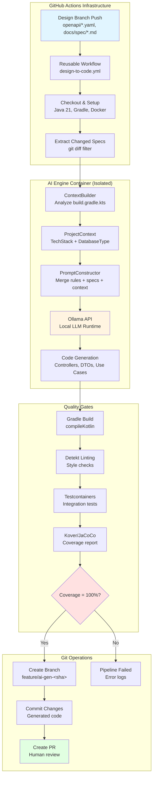

[SPECIFICATION]: Design-to-Code AI Pipeline Platform - 
Status: IN PROGRESS
>> do not commit this file or any test_{phase}.md files <<

1. TECHNICAL BLUEPRINT METADATA
Framework & Runtime: Kotlin / JVM 21 / Gradle Kotlin DSL
Architecture Pattern: Hexagonal (Ports & Adapters) for AI Engine; Event-Driven for CI/CD Orchestration
Database Boundary: ACID Compliant for Outbox Pattern; Git as source of truth for specifications
Design Principles: SOLID / Clean Architecture / Infrastructure as Code / Human-in-the-Loop

2. SYSTEM ARCHITECTURE & BOUNDARIES
The Design-to-Code AI Pipeline Platform is a distributed Internal Developer Platform (IDP) that orchestrates automated code generation from design specifications (OpenAPI/Markdown) to production-ready Kotlin implementations. The system operates as a centralized CI/CD infrastructure composed of: (1) A reusable GitHub Actions workflow that triggers on design branch merges; (2) A Kotlin-based AI orchestration engine running in isolated Docker containers that analyzes project context, constructs surgical prompts for Ollama (local LLM runtime), and executes code generation; (3) Quality gate enforcement through Testcontainers-based integration testing and 100% code coverage validation; (4) Automated Pull Request creation for human review. The platform serves multiple microservices across the organization, enforcing architectural standards (Clean/Hexagonal Architecture) while maintaining security through container isolation and non-interactive AI execution. The boundary is strictly infrastructure automation—no direct end-user APIs, only developer-facing CI/CD integration points.

3. DOMAIN STATES & INVARIANTS

Aggregate Roots & Entities:
- **PipelineExecution**: Represents a single pipeline run triggered by a design merge. Attributes: executionId (UUID), branchName (String), changedSpecs (List<SpecFile>), projectContext (ProjectContext), status (PipelineStatus), generatedBranch (String?), timestamp (Instant).
- **SpecFile**: Represents a changed specification file. Attributes: path (String), type (SpecType), content (String), hash (String).
- **ProjectContext**: Represents the target microservice's technical stack. Attributes: techStack (TechStack), database (DatabaseType), frameworkVersion (String).
- **QualityGateResult**: Represents validation outcome. Attributes: coveragePercentage (Int), compilationSuccess (Boolean), lintSuccess (Boolean), testsPassed (Boolean).

State Transition Matrix:
Initial State | Command / Event | Target State | Core Guard & Invariants
IDLE | SPEC_MERGED | CONTEXT_ANALYSIS | Changed files must be .yaml/.yml/.md in design/** branch
CONTEXT_ANALYSIS | CONTEXT_DETECTED | AI_GENERATION | Project stack must be Spring Boot or Quarkus
AI_GENERATION | CODE_GENERATED | QUALITY_VALIDATION | Generated code must compile successfully
QUALITY_VALIDATION | COVERAGE_100_PERCENT | PR_CREATION | All quality gates must pass (compile, lint, test, coverage)
QUALITY_VALIDATION | COVERAGE_BELOW_100 | FAILED | Pipeline fails with detailed error report
PR_CREATION | PR_CREATED | COMPLETED | PR must be created with proper base branch
FAILED | RETRY_TRIGGERED | CONTEXT_ANALYSIS | Max 3 retry attempts allowed
FAILED | MAX_RETRIES_EXCEEDED | TERMINATED | Manual intervention required

4. API & INTERFACE CONTRACTS

4.1 Inbound Adapters (CLI / GitHub Actions Integration)
Endpoint: CLI Entry Point (Kotlin Main)

Request Payload (Command-Line Arguments):
{
  "changedFiles": "space-separated list of modified spec file paths",
  "workspacePath": "absolute path to target microservice repository",
  "ollamaModel": "Ollama model name (e.g., codellama:13b, deepseek-coder:6.7b)"
}

Response Matrix:
Exit Code 0 -> Pipeline completed successfully, PR created.
Exit Code 1 -> Pipeline failed at any stage (compilation, coverage, AI execution).
Stdout -> Structured logging with stage markers and error details.

4.2 Outbound Adapters (Ports & Infrastructure)
- **Git Operations Port**: Interface for branch creation, commit, and PR operations via GitHub CLI or API.
- **Build System Port**: Interface for Gradle execution (compile, test, coverage, lint).
- **AI Agent Port**: Interface for AI code generation with method `generate(prompt: String, workspace: File): GenerationResult`. Implementations: OllamaAdapter (local LLM), ClaudeAdapter (cloud API), OpenAIAdapter.
- **Docker Runtime Port**: Interface for container orchestration and Testcontainers lifecycle.
- **Event Mesh**: GitHub Actions webhook triggers; no explicit event bus (Git as event source).

5. ARCHITECTURAL DESIGN



**Component Responsibilities:**

- **GitHub Actions Workflow**: Triggers on design branch merges, filters spec files, orchestrates pipeline execution, manages secrets
- **ContextBuilder**: Analyzes target repository build.gradle.kts to detect TechStack (Spring Boot/Quarkus) and DatabaseType (PostgreSQL/MongoDB)
- **PromptConstructor**: Merges global architecture rules, project context, and changed specs into surgical AI prompts
- **Ollama**: Local LLM runtime executing code generation models (CodeLlama, DeepSeek-Coder), modifies workspace files with generated Kotlin code
- **Gradle Build System**: Compiles generated code, runs Detekt linter, executes Testcontainers integration tests
- **Kover/JaCoCo**: Measures code coverage, enforces 100% threshold on generated classes
- **Git Operations**: Creates feature branches, commits generated code, opens Pull Requests for human review

**Communication Flow:**
1. Git webhook triggers GitHub Actions workflow
2. Workflow mounts target workspace into isolated Docker container
3. AI Engine analyzes context and constructs prompts
4. Ollama API receives prompts and generates code
5. Gradle validates generated code through quality gates
6. Git operations create PR if all gates pass

6. REFINED BUSINESS LOGIC FLOW
- **Intercept & Validate**: GitHub Actions workflow intercepts push events on design/** branches, filters for .yaml/.yml/.md files, extracts changed file paths.
- **Context Execution**: AI Engine container mounts target workspace, analyzes build.gradle.kts to detect TechStack (Spring Boot/Quarkus) and DatabaseType (PostgreSQL/MongoDB), loads global architecture rules from mounted rules directory.
- **Prompt Construction**: Engine constructs surgical prompt merging: (a) Global Clean Architecture rules; (b) Local project context; (c) Changed specification contents; (d) Framework-specific instructions.
- **AI Generation**: Invokes Ollama API with constructed prompt, allowing AI to modify workspace files directly (Controllers, DTOs, Use Cases, Repository interfaces).
- **Quality Validation**: Executes Gradle clean build detekt koverVerify, parses coverage report, enforces 100% coverage threshold on generated classes.
- **Outbox Stage**: If quality gates pass, commits generated code to new branch feature/ai-gen-{sha}, creates PR pointing to main/develop with validation summary.
- **Acknowledge**: Pipeline exits with success; human developer reviews and merges PR.

6. EDGES, CONCURRENCY & RESILIENCY
- **Idempotency Strategy**: Pipeline execution is idempotent via Git branch naming (feature/ai-gen-{sha})—re-running with same commit hash attempts to use existing branch or fails gracefully.
- **Concurrency Management**: Optimistic locking via GitHub Actions mutex to prevent concurrent pipeline runs on same repository; container isolation prevents workspace corruption.
- **Failure Recovery**: Non-interactive AI mode fails fast on unresolved errors; retry logic with exponential backoff (max 3 attempts) for transient failures; detailed error logging in GitHub Actions logs.
- **Security Isolation**: Ollama runs locally in container with no external API dependencies; no cloud infrastructure secrets exposed; Docker socket mounting limited to Testcontainers only.
- **Resource Limits**: 15-minute timeout per command execution; container resource limits enforced by GitHub Actions runner.
- **Human-in-the-Loop**: Automatic merge disabled; PR requires human review before merging to main branch.

7. TEST DRIVEN DEVELOPMENT (TDD) PER PHASE 
(See test-{phase}.md for detailed test scenarios)

Phase 1: Context Analysis & Detection
- Test: Detect Spring Boot project from build.gradle.kts
- Test: Detect Quarkus project from build.gradle.kts
- Test: Detect PostgreSQL database dependency
- Test: Detect MongoDB database dependency
- Test: Handle unknown stack gracefully
- Test: Parse changed files from git diff output

Phase 2: Prompt Construction
- Test: Merge global rules with project context
- Test: Inject framework-specific instructions for Spring Boot
- Test: Inject framework-specific instructions for Quarkus
- Test: Construct prompt with multiple spec files
- Test: Handle empty spec files list

Phase 3: AI Generation Integration
- Test: Invoke Ollama API successfully
- Test: Handle Ollama connection errors
- Test: Handle AI timeout scenarios
- Test: Validate AI modifies correct files
- Test: Handle model unavailability

Phase 4: Quality Gate Validation
- Test: Execute Gradle build successfully
- Test: Execute Detekt linting
- Test: Execute Kover coverage verification
- Test: Parse coverage report for 100% threshold
- Test: Fail pipeline when coverage < 100%
- Test: Fail pipeline when compilation fails

Phase 5: Git Operations & PR Creation
- Test: Create feature branch from current HEAD
- Test: Commit generated code changes
- Test: Create Pull Request via GitHub CLI
- Test: Handle branch already exists scenario
- Test: Handle GitHub API authentication failures

8. ARCHITECTURAL ASSUMPTIONS
- **Target Framework**: Assumes target microservices use either Spring Boot or Quarkus (detected at runtime). Other frameworks would require extension.
- **Database Support**: Assumes PostgreSQL or MongoDB for Testcontainers configuration. Other databases would require additional detection logic.
- **Coverage Tool**: Assumes Kover or JaCoCo is configured in target project's Gradle build.
- **Git Branching**: Assumes design/** branches exist and follow naming convention.
- **Container Runtime**: Assumes GitHub Actions runner supports Docker-in-Docker or socket mounting for Testcontainers.
- **AI Agent Port**: Uses Hexagonal Architecture pattern with AI Agent Port interface for decoupling. Default implementation: OllamaAdapter (local LLM). Alternative implementations: ClaudeAdapter (Anthropic API), OpenAIAdapter (GPT models). Switching providers requires only implementing the port interface and configuration change—no core logic changes.
- **Configuration Example**: AI Agent provider selection via environment variable or config file:
  ```yaml
  # application.yml
  ai-agent:
    provider: ollama  # Options: ollama, claude, openai
    ollama:
      host: localhost
      port: 11434
      model: codellama:13b
    claude:
      api-key: ${CLAUDE_API_KEY}
      model: claude-3-5-sonnet
    openai:
      api-key: ${OPENAI_API_KEY}
      model: gpt-4o-mini
  ```
- **Ollama Advantages**: Complete data privacy (all processing stays local), zero latency after model load, vendor independence, compliance with data residency requirements, custom model fine-tuning capability, no internet dependency after initial model download.
- **Model Availability**: For OllamaAdapter: assumes service is running locally or in container with required models pre-downloaded (codellama:13b recommended for code generation). For cloud adapters: assumes valid API keys are configured in environment variables.
